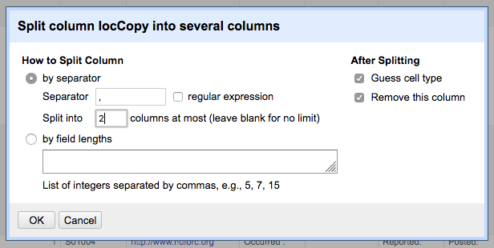

# Data Cleaning Steps
UFO sightings were webscraped from NUFORC.org data using [NUFORCscrape.py](Webscrape/NUFORCscrape.py). The output data (NUFORCraw.csv) requires significant preparation before it can be used as an input dataset for the [GIS](Geocoding.md) and [text analysis](TextAnalysis.md) steps of this study.

This file acts as a data log. Herein, I provide a walkthrough for every step in the data cleaning process. I attempt to document every spreadsheet formula and code snippet, as well as the reasoning behind many selection and exclusion decisions made while cleaning the data. Tools used include LibreOffice Spreadsheets (or Microsoft Excel), Python, and GoogleRefine.

Versions of the dataset were saved after every step and named for the completed step. Cleaned data is currently unavailable for download.

Data used in this example was gathered on 8-31-2018.

To see documentation of the geocoding or text analysis processes see (other files yet to be created.)  

#
### Step 0: Raw Data
| 'A' |  'B'   | 'C'     |  'D'    |  'E'  |   'F'   |  'G'    |  'H'    |   'I'    |
|-:|:--|:--|:--|:--|:--|:--|:--|:--------|
1|	http://www.nuforc.org/webreports/001/S01001.html |	Occurred : 11/17/1995 22:35|	Reported: 11/20/1995 08:30	| Posted: 3/4/2003 |	Location: Biddeford, ME |	Shape: 	|Duration:2 min.	|Observer had left work about one hour early, and drove home along the Maine Turnpike
1|	http://www.nuforc.org/webreports/001/S01002.html |	Occurred : 11/19/1995 20:45 |	Reported: 11/20/1995 08:53	 | Posted: 3/21/2003 | 	Location: Holton, KS |	Shape: 	 | Duration:15 min.	| Youth w/ friend pursue on Hwy. 16 "triangular thing in sky, w/ yellow, blue, and green" lights. Obj. turned abruptly, flew north.
1	| http://www.nuforc.org/webreports/001/S01003.html |	Occurred : 11/20/1995 06:15	| Reported: 11/20/1995 09:50	| Posted: 3/21/2003	 | Location: Belle Fourche, SD |	Shape: | 	Duration:2 sec.	| MUFON State Dir. relays rpt:  Postal empl. heading W on highway witnesses very large white w/ green tail streak vert. to horizon.

These are the first three rows from the raw output of the [NUFORCscrape.py](Webscrape/NUFORCscrape.py) script. (The header row is actually absent in the raw data but have been included here for reference.)

The first two columns, 'A' & 'B' are added while writing every line and they record the batch number and the text's source url.

The rest of the data comes from a font html element on each page. HTML break tags,`` ``, separate each column of data in the original html. As a result the xpath method in the following line

    sightpath = sightdata.xpath('//tbody/tr/td/font/text()')

of the [NUFORCscrape.py](Webscrape/NUFORCscrape.py) script automatically formats the text in between break as a new column when data are written to a .csv.

The result is a (mostly) well structured dataset.

The first irregularity to correct has to do with how`` ``tags are interpreted.

| 'A' |  'B'   | 'C'     |  'D'    |  'E'  |   'F'   |  'G'    |  'H'    |   'I'    | 'j' | 'k ' | 'l' | 'm'|
|-:|:--|:--|:--|:--|:--|:--|:--|:--------|:--|:--|:--|:--|
2 |	http://www.nuforc.org/webreports/002/S02549.html	|Occurred : 11/18/1995 21:00  (Entered as : 11-18-1995 21:00)	| Reported: 7/17/1997 11:37	Posted: 3/21/2003	| Location: Ringgold, GA	| Shape: Delta |	Duration:15 min.	 | Summary : On Saturday evening just after dark on November 18, 1995 an arrowhead-shaped ufo was spotted to the east approx. 100 yrds. from Davis Ridge Road hoovering just above tree top level, shinning a beam downward behind the neighbors home. It was motionless and totally silent. It had a light at each corner and the beam came from the center. It was approx. 40' x 25'. After I got out it started moving west at about 5 mph. | We followed until it descended behind a ridge out of sight about a half mile away. The neighbors had cattle out back. -((deleted)) Administrator	I also work as the founder and administrator of ((deleted)) , a satellite and high altitude survey and mapping oriented organization that provides information about new technology for discovering natural resources and minerals, surveying, guides, and related issues  ((URL deleted)) . | I'll take any test to prove the validity of my observation. My family is highly respected in the community as honest and truthful. On one Saturday evening just after dark  | The black, arrowhead-shaped ufo was hoovering silently as it casted a cone-shaped beam into the neighbors back yard. We couldn't see what it was shinning on as it was behind the crest of the high-ground behind the house where the cattle were kept. I got out of the car which was stopped in the middle of the road and looked over the roof at the ufo in astonishment. It was completely silent. It had a light at each corner underneath and the beam came from the bottom center of the craft. | Apparently, we were spotted too, and the ufo turned the beam off. Then it proceed at a low speed (approx. 5 mph) to the west. We were observing the ufo eastward from Davis Ridge Road at first. It came almost directly over us. It was about 80' off of the ground. It continued west and we turned the car around and followed. The road ran north and south though, and b! y the time we were heading west coming off the ridge we saw it descend below a ridge to the west of us. We saw it no more.  | The whole affair lasted about 15 minutes. Everyone in the car saw it. We all had gotten out to see it before we jumped back in to pursue it. I got the impression that the occupants of the craft could care less if we saw it that night, as it seemed to be in no hurry for the most part.																																						
Take line 1549, seen above, as an example: paragraph breaks  - sets of two`` ``tags - create new column for each block of text displayed as a new paragraph. This unnecessarily extends the width of the dataframe and splits the text narratives apart.

Recombining the text narratives into one column and normalizing the shape of the data should be the first data cleaning step taken, otherwise every time the data is sorted by columnar values, risks losing parts of sighting narratives.
#
### Step 1: Concatenate sighting text in to one column
     =CONCATENATE(J1," ",K1," ",L1," ",M1," ",N1," ",O1," ",P1," ",Q1," ",R1," ",S1," ",T1," ",U1," ",V1," ",W1," ",X1," ",Y1," ",Z1," ",AA1," ",AB1," ",AC1," ",AD1," ",AE1," ",AF1," ",AG1," ",AH1," ",AI1," ",AJ1," ",AK1," ",AL1," ",AM1," ",AN1," ",AO1," ",AP1," ",AQ1," ",AR1," ",AS1," ",AT1," ",AU1," ",AV1," ",AW1," ",AX1," ",AY1," ",AZ1)

Create a new column in the .csv file to the immediate left of the sighting narrative column (initially column 'I', which becomes 'J' after the inserting the new row). The formula shown above, when input as a spreadsheet formula, concatenates each additional column created by paragraph breaks into the new column ('I'), when the formula is applied to the entire column (select the column and use 'Ctrl + D', or copy down).

Both LibreOffice and Microsoft Excel add extra rows after applying formulas to entire columns on large datasets. Once the sightings narratives have been concatenated and their text values have been pasted into the same column (as opposed to formula values), copy all the rows and columns that contain unique data (so the whole dataframe) into a new spreadsheet.

This can be done by selecting the 1st through the final row from column A to I into a new spreadsheet. Data used for this project initially totaled 142,000 rows

#
### Step 2: Add a sighting number to each row

Sighting numbers add unique ID numbers to every row. A simple way to do this is to use the end of the url, stripped of .html. Another integer based unique ID will be added in the final step of this process.

Add a new column between columns 'A' and 'B'. Use the following formula to populate the column with a new value.

     =RIGHT(C1,12)

Copy the text values produced and paste them into the same column.

Use find and replace to remove '.html' and the leading '/'

 When step two is complete the first three columns of the dataset should look like this:

|  |     |      |
|-:|:--|:--|
1|	S01001 |	http://www.nuforc.org/webreports/001/S01001.html |
1|	S01002 |	http://www.nuforc.org/webreports/001/S01002.html |
1|  S01003 |  http://www.nuforc.org/webreports/001/S01003.html

#
### Step 3: Split 'Occurred' column by '('

The 'Occurred' column (formerly column 'C', now 'D') has a parenthetical value included in many of the data (see line 1549, column 'C', above). The values that start '(Entered as:)' need to be split out of this column and into a new one.

Using 'Text to Columns' runs the risk of overwriting columns that hold existing data with mostly blank columns created by errant delimiters.

However, GoogleRefine provides the option to split data into a maximum number of columns.

Using the data saved after Step 2, create a project in GoogleRefine. Select the 'Occurred:' column ('Column 4'), next select 'Edit column' and then 'Split into several columns'.

Input '(Entered' as a the value in the separator box, and split into '2' columns at most, as seen below.

The new column, 'Column 4 2', will contain the raw 'Entered As:' data and 'Column 4 1' will now only contain standardized 'Occurred' data.

#
### Step 4: Remove leading string segments

Every value scraped from the 'font' element is preceded by a value title, like 'Occurred', 'Reported', or 'Location'. Many of the sighting narratives in the final column are also preceded by 'Summary'.

These values can also be cleaned in GoogleRefine.

Select a column, such as 'Column 4 1', next select 'Edit cells', and then 'Transform cells'. In the GREL dialog box use the following code snippet:

    replace(value, 'Occurred :', '')

This effectively deletes every occurrence of 'Occurred:' in the column's values. Note that the space following the colon is left intact. Leading spaces allow the column to retain the string data type by default.

Rename the column based on the string segment being removed. Repeat the replace and rename process for every applicable column. For the sighting narrative column replace 'Summary :'

These edits (usually) applied to 116,448 cells in each column for the dataset being used in this project.

When this step has been completed the first three rows of the dataset should look like this:

| 'bNo' |  'sNo'   | 'url'     |  'occurred'    |  'enteredAs'  |   'reported'   |  'posted'    |  'locationRaw'    |   'shape'    |  'duration' | 'sighting' |
|-:|:--|:--|:--|:--|:--|:--|:--|:--|:--|:--------|
1	| S01001 |	http://www.nuforc.org/webreports/001/S01001.html |	 11/17/1995 22:35	|	 | 11/20/1995 08:30	| 3/4/2003|	 Biddeford, ME	| |	2 min.|	Observer had left work about one hour early, and drove home along the Maine Turnpike                                          
1	| S01002	|http://www.nuforc.org/webreports/001/S01002.html	 | 11/19/1995 20:45	|	| 11/20/1995 08:53	| 3/21/2003	 | Holton, KS	| |	15 min.	| Youth w/ friend pursue on Hwy. 16 "triangular thing in sky, w/ yellow, blue, and green" lights. Obj. turned abruptly, flew north.                                          
1	| S01003 |	http://www.nuforc.org/webreports/001/S01003.html	| 11/20/1995 06:15	|| 11/20/1995  09:50	 | 3/21/2003 |	 Belle Fourche, SD	| |	2 sec. |	MUFON State Dir. relays rpt:  Postal empl. heading W on highway witnesses very large white w/ green tail streak vert. to horizon.                                          

#
### Step 5: Check errors, remove empty rows

##### Error Checking

This step is completed in GoogleRefine or in a desktop spreadsheet program (LibreOffice or Microsoft Excel).

Begin by sorting the values by the first column, the batch number ('bNo').

This separates all successfully loaded rows from the rows where an error occurred during the request or writing stage. Errors are brought to the top of the dataset using a descending sort.

The 38 rows written with errors contain several repeats and international sightings (which are ultimately going to be excluded) contain sightings and should be included with the main dataset. I copied the information for these 20 or so rows a cell at a time.

This procedure involves copying the URL of an error row and pasting it into a web browser. All of the information for each sighting that occurs in the United States must be copied into the row corresponding to the url.

##### Removing empty rows

Sort the data by the sightings column using a descending sort. This brings empty values for the 'sightings' column to the top. These are also errors and their urls should be checked for content.

Once these sightings have been pasted in place, a few leading spaces need correcting, then it is on to a final descending sort of the 'sightings' column.

At the end of the dataset, sorted in descending order based on the text in the 'sighting' column, there are empty rows which correspond to web pages that respond with 404 errors. These are blank pages, which I assume are placeholders for hoax reports that have been removed or sequestered from public display.

Delete these empty 'sighting' reports.

The resulting dataset used in this project, after this step was completed totaled 116,455 rows.

#
### Step 6: Split up values in 'locationRaw'

In GoogleRefine, select the 'locationRaw' column and create a column based on it. Name the new column 'locCopy'.

Split 'locCopy' into two new columns using the comma as a separator. It is crucial that it is split into no more than two columns. See the screenshot below:

Rename 'locCopy 2', the post-comma column, 'lStateRough'.

Next, select the 'locCopy 1' column and split it again, this time by '(' and again choosing 2 for the option, 'Split into ____ columns at most'.

Rename 'locCopy 1 1', 'lCityRough'

Rename 'lCopy 1 2', 'lParenthesis'

#
### Step 7: Trim cell values

Splitting columns by separators often creates extra spaces before or at the end cell values.

Edit the cell values in each column using the common transforms setting, 'Trim leading and trailing whitespace', under the 'Edit cells' menu option, as seen below. Trim every column, except 'Occurred' to maintain it's default data type as a string.

#
### Step 8: Convert cell values to lowercase

Similar to trimming columns, applicable text columns should be converted to lowercase.

Specifically, every location column except 'locationRaw' ('lCityRough', 'lParenthesis', & 'lStateRough') and all text description columns except 'sighting' ('shape' & 'duration') can be converted to lowercase.

Like the trim transformation, this is done using a common transform, 'To lowercase', in GoogleRefine's 'Edit cells' menu option, see below.

#
### Step 9: Cluster 'lStateRough' cell values

GoogleRefine is capable of clustering similar, potentially matching values together and has a handy interface which lets the user specify which cluster value by value.

Clustering is useful for homogenous data types that may be input differently according to user errors and inconsistencies.

Clustering is also a good test of whether or not data cleaning has normalized cell values in a given column. When no clusters exist all of the possible values in the column are uniform, the values are a controlled vocabulary.

Take the 'shape' column for example. No values can be clustered. Each instance of 'unknown', 'light', 'diamond', or other value for the 'shape' column has been misspelled or incorrectly capitalized thanks to input consistency and data cleaning up to this point.

Duration data is not of great importance to this study and so will not be further clustered.

Location data, on the other hand, is of primary importance to this study and will be clustered iteratively and carefully.

Select 'Edit cells' and 'Cluster and edit' from the editing interface, which is opened by clicking the downward facing arrow next to the column title, in this case cluster 'lStateRough'.

Clustering the values according to the default method, key collision, with they keying function set to fingerprint generates only 32 clusters!

 

After examining the 32 clustered values it appears that all of the values can be clustered. Select all, then click 'Merge Selected & Re-cluster'. Following this step the values in the 'lStateRough' column should be normalized and can be meaningfully sorted.

#
### Step 10: Sort by 'lStateRough', mark excluded values (international, in-flight) and possible rural sightings

This is the most time consuming and sensitive step in the data cleaning process. This step involves checking values, line by line and should be completed in LibreOffice or Microsoft Excel, which facilitates scrolling through the entire dataset much better than GoogleRefine does.

Sorting by the state value causes many of the international values to become clustered together for easier identification and marking for exclusion.

Create a new column titled 'INTLx4delete' to capture an 'x' for an input to represent an international sighting or a '?' for unclear or ambiguous locations. Once international values have been marked for deletion, blank and aberrant values in location columns can are assessed individually.

While completing this task some potential rural sightings are also identified. Create a new column titled 'R4rural' to capture sightings identified as potentially rural with the letter 'r'.

##### 'x' criteria
Sightings, (data rows) receive an 'x' based on the following criteria:

* The value in 'lStateRough' (or any other location field) is not one of the 50 U.S. States or Washington, D.C.
  * e.g. 'nsw', 'australia'

* The value in 'lStateRough' (or any other location field) indicates that the sighting took place in flight or on an airplane.
    * Geographic analysis performed later in this study will not consider airborne sightings, thus they can be easily removed at this point.
    * Sightings occurring over water, however, will be included as long as the sighting was witnessed from land (ie at a beach or on the shore of a lake) rather than from a boat.

##### 'r' criteria
Criteria for receiving an 'r' follow:

* Values in 'lStateRough' with qualifiers or parenthetical values that indicate the sighting is outside of an urban center
  * e.g. ".5 mi down", "(east of", "exit 113", etc.

* Multiple states are given in the 'lStateRough' field, usually indicating the sighting occurred on a highway near a border.
    * e.g. "co, ut", "vt,nh", "fl & ga", etc.

* Rows that would otherwise qualify but parenthetically mention 'suburbs of' a major metropolitan area DO NOT recieve and 'r'

##### '?' criteria

Sighting rows are marked with a '?' in the 'INTLx4delete' according to the following criteria:

* No location data is present in any location column
    * e.g. " , "

* Location data is unclear and requires closer inspection

* Locations without state information and city or municipality data that could identify multiple places

Once all the values in 'lStateRough' have been checked ('from .5 mi' to 'yt') use a custom sort a to sort the dataset by 'lStateRough' and then by 'lParenthesis' in ascending order. This puts the parenthetical values in the last 8,000 or so entries in alphabetical order. These last 8,000 entries are mostly international sightings, but many are erroneously entered US sightings and thus must be checked line-by-line.

As data is reviewed in this step the 'correct' cell value for 'lStateRough' is transferred from information in 'locationRaw', when that location is sufficient enough to identify a location.

The goal of this step is to identify all international sightings and mark them with 'x' in the 'INTLx4delete' column so that they may be removed (in step 12). Then, a subsequent sort by the 'lStateRough' column will produce a complete dataset of UFO sightings in United States.

At the end of this stage the dataset used in this study was XYZ lines. With 13136 marked for exclusion.

Below is an image of the data cleaned up to this point.

#
### Step 11: Review '?' marked rows

Sort values in the 'INTLx4delete' column in descending order to bring all of the 'x' and '?' marked rows to the top of the dataset.

Scroll down to the beginning of the '?' rows, which for this study started at row 13137 and continued until row 13563, a total of 426 rows for review.

Each of these 426 sightings must be individually read to determine the location of the sighting. When no location is apparent from the text narrative the following criteria are applied to include or exclude the data.

##### Criteria for inclusion

* Sightings that only have a city name, but no country will be included when the name exists as a city or incorporated area in the United States.
    * e.g. "Manchester", "Gillingham",  "Galway", etc.
    * City names included through this process are checked in by running the name through a Google search followed by "USA". This identifies many of these entries as rural US towns.
        * When multiple locations in the United States share a name, the most populated area is chosen. For instance several cities in the US are named "Shelbyville", but for entries without state location data, 'TN' is assumed.

##### Criteria for exclusion

* Sightings that mention a foreign country or foreign government entities in the text of the narrative are excluded.
    * e.g. "South Africa", "RAF", "over the ocean in bali"

* Sightings with no apparent location data submitted in a foreign language are excluded.

* Sightings determined to be observed in flight are excluded.

* Sightings with deleted or withheld location data are excluded.

* Sightings with incomplete information, such as a state but no discernible city or town are excluded.
    * e.g. "Desert in Southern California", "Carolina"

* Sightings with ambiguous locations that occurred in the past are excluded.

* Sightings that were seen on television programs are excluded.
    * e.g. "on Monday Night Football", "while watching Jaws", "On YouTube video" etc.

#
### Step 12: Delete 'x' marked, excluded Rows

Once the '?' entries have been reviewed, re-sort the dataset by the 'INTLx4delete' field in descending order. Then select all of the rows marked 'x' and cut them out of the dataset using 'Ctrl + X'. Paste these rows into a new spreadsheet or workbook and save the dataset as 'NUFORCinternationalflightsEXCLUDED.csv'.

Delete the empty rows from the cleaned, US only dataset. Save it.

#
### Step 13: Mark probable rural sightings

Sort the dataset by a custom ascending sort on the 'lParenthesis' column followed by the 'lStateRough', 'lCityRough', and finally 'sNo' columns and save it. See below for a screenshot of the custom sort:

This pulls all of the sightings with parenthetical values to the top.

Almost every sighting with a parenthetical value is assumed to be rural, since entries tend to be '10 miles outside of', 'rural', etc.

One exception to this is values like 'above; in flight' or 'in-flight', etc. These values should be examined one by one and if the sighting is from a plane, should be cut out of the dataset and added to the 'NUFORCinternationalflightsEXCLUDED.csv' file.

The second exception to this occurs when sightings in metropolitan areas specify a neighborhood after the city name, i.e. 'New York City (brooklyn)' has a 'brooklyn)' for a value in the 'lParenthesis' column. During this step this sighting will be marked with the 'r'. However, subsequent steps in the geocoding process will eliminate this sighting from the rural dataset.

Put another way, false positives generated in this step by drag-copying 'r' in the 'R4rural' for all rows with values in the 'lParenthesis' column will be caught and corrected in a future step in the geocoding process. See the [Geocoding](Geocoding.md) document.

Mark all the rows with a value in the 'lParenthesis' (except 'above', 'above; in-flight', and 'in-flight' values) column with 'r'.

For this study, the dataset saved at the end of this step, 'ThesisDCstep12.csv', contained 102,989 lines.

'NUFORCinternationalEXCLUDED.csv contained 13,473 lines.'

#
### Step 14: Create 'cityState' column.

In either GoogleRefine or a spreadsheet create a new column based on 'lCityRough' and 'lStateRough' that concatenates the (already) lowercase values together separated by a comma.

The spreadsheet formula for this action would be:

    =CONCATENATE(I1, ", ", K1)

Then the formula should be copied into a new column, using 'Ctrl + D' and those cells, in turn, should be copied and pasted in as values, as has been done in previous steps. Meaning that the last step will include copying the entire dataset into a new document to avoid excess rows.

#
### Step 16: Final column splits and cleanup.

#
### Step XX: Sort and save

Load the data into a spreadsheet program and complete a final custom sort by 'cityState', 'lParenthesis', ,'bNo', and finally 'sNo'. See below for a screenshot. Examine the data and save as 'NUFORCclean.csv'
