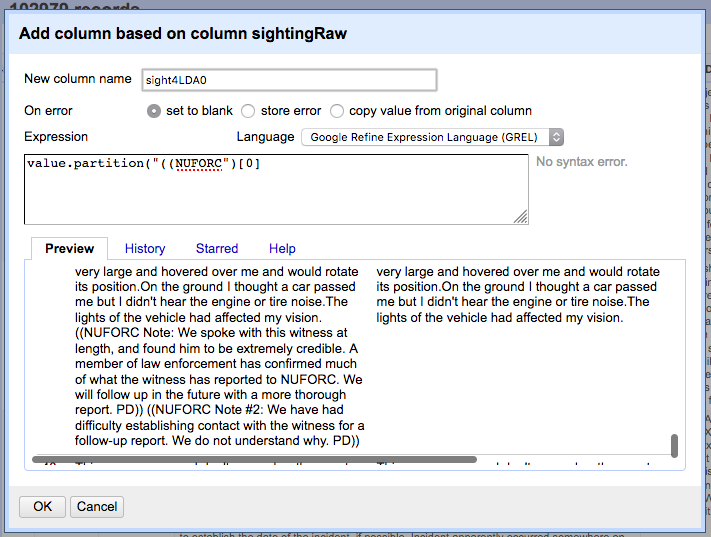

#
### Step 1: Remove NUFORC notes from 'sightings'

Load the dataset into GoogleRefine one last time.

Rename the 'sightings' column 'sightingsRaw'. Add a column based on that column named that partitions the values in the column by "((NUFORC".

This effectively removes all the extra notes provided by NUFORC at the end of many sighting narratives. Much of this information is interesting, but its presence will skew text analysis in later portions of this study. Name the new column 'sight4LDA0' See the screenshot below for other options settings.

Next, repeat this process but capture the last portion of the partition, the other bun of the sandwich, if you will.

 Use the following code in GREL to perform this task:

    value.partition("((NUFORC")[2]

Name the column 'sight4LDA2'

Export this dataset and load it into a spreadsheet program and sort with a custom sort by 'sight4LDA0' in descending order then 'sight4LDA2' in ascending order.
